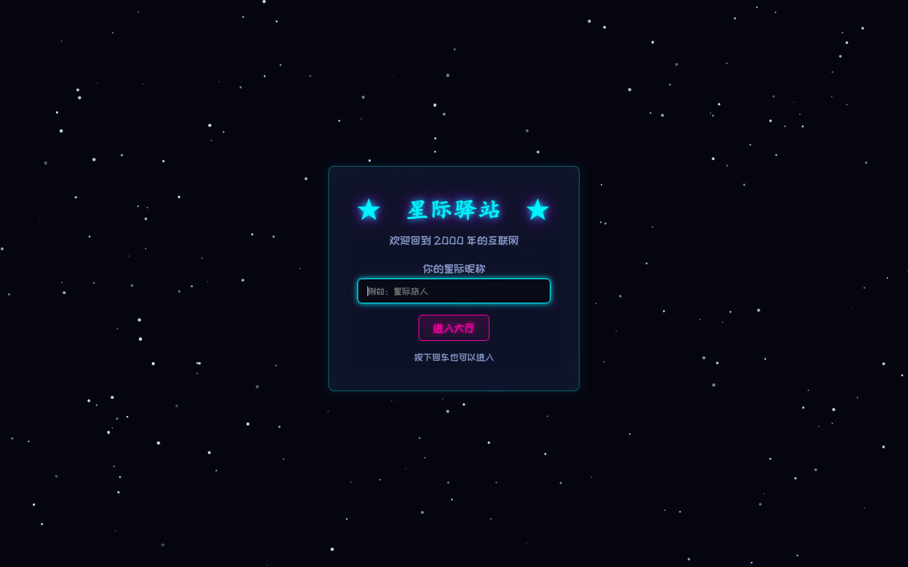
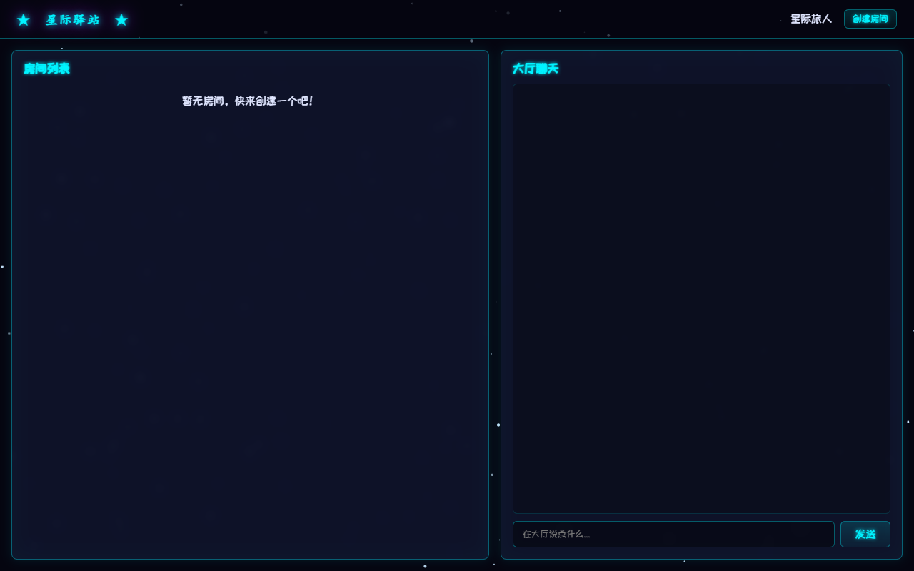
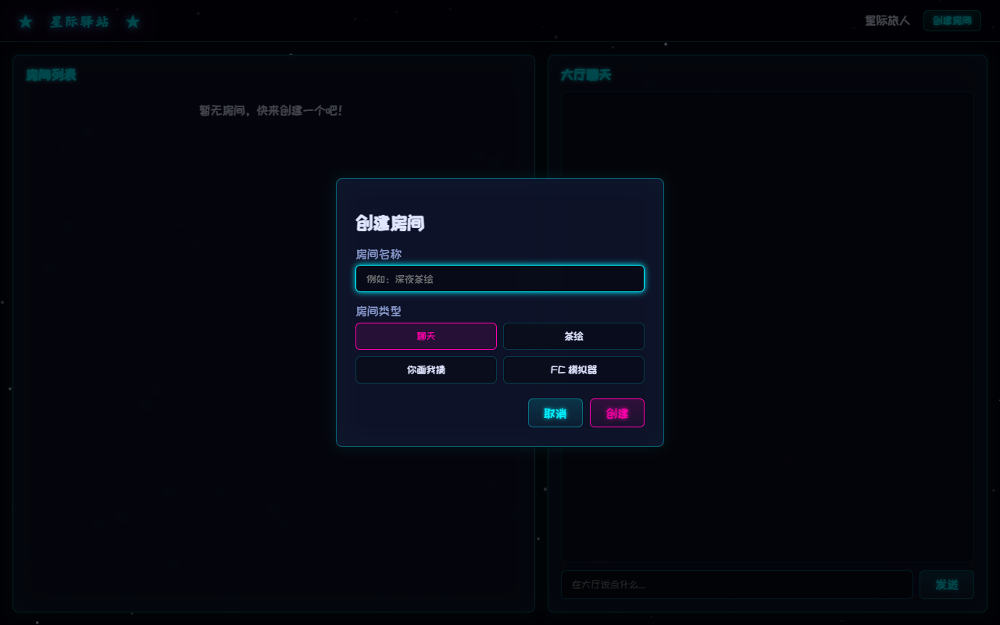
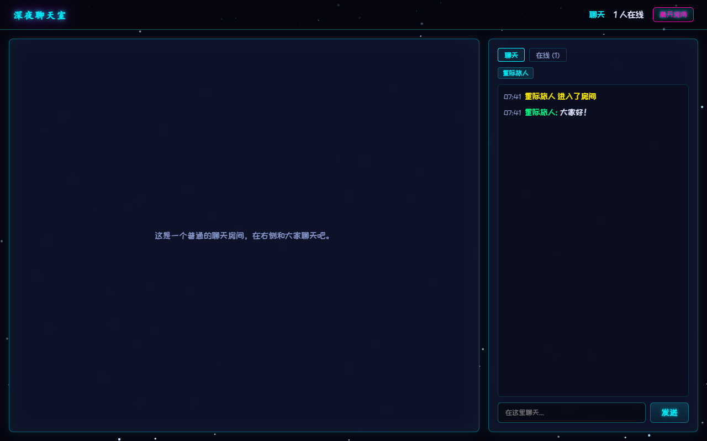
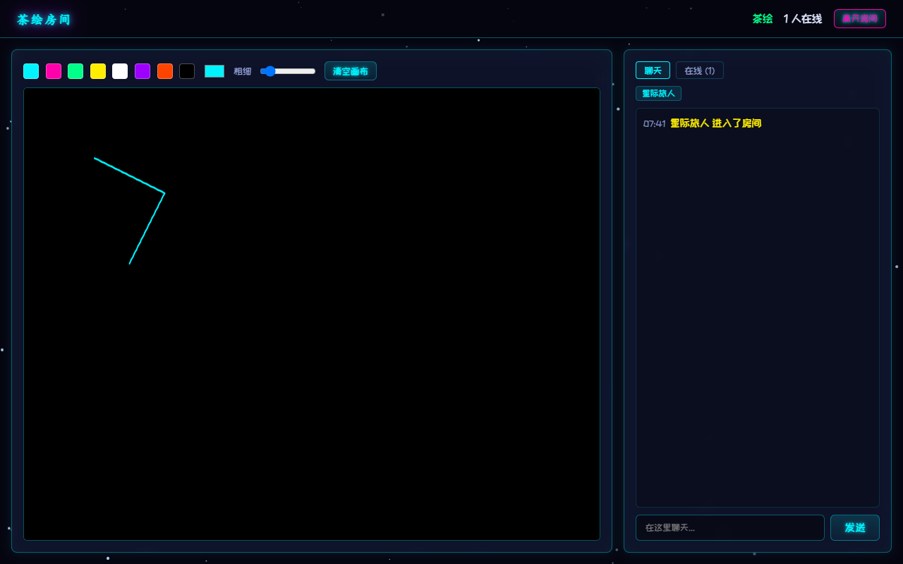
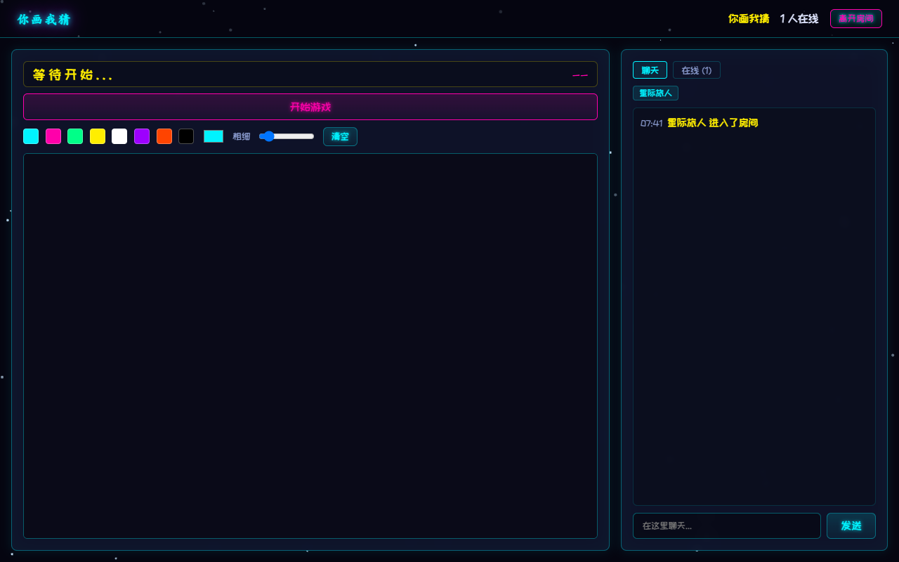
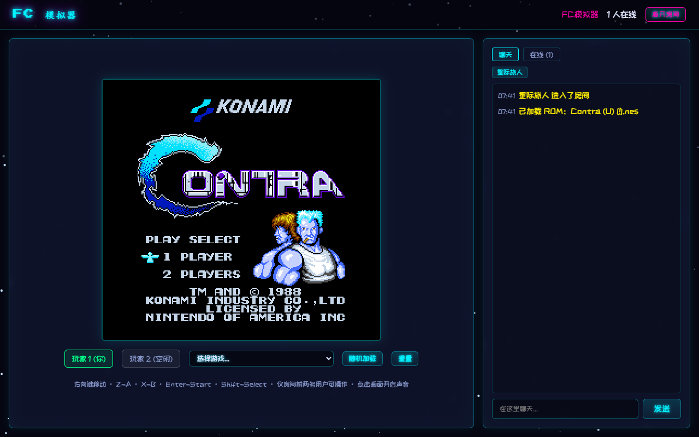

# ★ 星际驿站 ★

一个星空古早互联网风格的个人主页，包含实时聊天室、茶绘、你画我猜和多人 FC 模拟器。

## 功能

- **星空动态背景**：全屏Canvas星空动画
- **中央大厅**：查看房间列表、大厅聊天
- **聊天房间**：基础的群聊功能
- **茶绘房间**：多人同时在画布上涂鸦
- **你画我猜**：系统随机出题，轮流作画，其他人抢答
- **多人 FC 模拟器**：加载 FC/NES ROM，房间前两名用户可操作手柄
  - ROM 来源：[zdg-kinlon/FC_ROMS](https://github.com/zdg-kinlon/FC_ROMS)
  - 操作键：方向键移动，Z=A，X=B，Enter=Start，Shift=Select

## 截图

| 首页登录 | 中央大厅 |
|:---:|:---:|
|  |  |

| 创建房间 | 聊天房间 |
|:---:|:---:|
|  |  |

| 茶绘房间 | 你画我猜 |
|:---:|:---:|
|  |  |

| FC 模拟器 |
|:---:|
|  |

## 一键部署启动

### Windows

双击运行：

```
scripts/deploy.bat
```

或在 PowerShell / CMD 中：

```bash
node scripts/deploy.js
```

### macOS / Linux

```bash
./scripts/deploy.sh
```

脚本会自动完成：检查 Node.js → `npm install` → 检测/下载 ROM → 启动服务。

## 手动快速开始

```bash
npm install
npm start
```

然后打开浏览器访问 http://localhost:3000

### ROM 说明

FC 游戏 ROM 已预置在 `public/roms/` 目录中（共 10 个，包含魂斗罗和松鼠大作战）。
如需更换或补充 ROM，可以把 `.nes` 文件放入 `public/roms/`，服务器启动时会自动扫描。
也可以运行 `node scripts/download-roms.js` 从 GitHub 仓库重新随机下载 10 个 ROM。

## 文件结构

```
.
├── server.js          # Node.js + Socket.IO 后端
├── public/
│   ├── index.html     # 页面结构
│   ├── css/
│   │   └── style.css  # 星空复古风格样式
│   └── js/
│       └── app.js     # 前端逻辑
└── package.json
```

## 技术栈

- Node.js
- Express
- Socket.IO
- JSNES（FC 模拟核心，浏览器端运行）
- Web Audio API（FC 声音输出）
